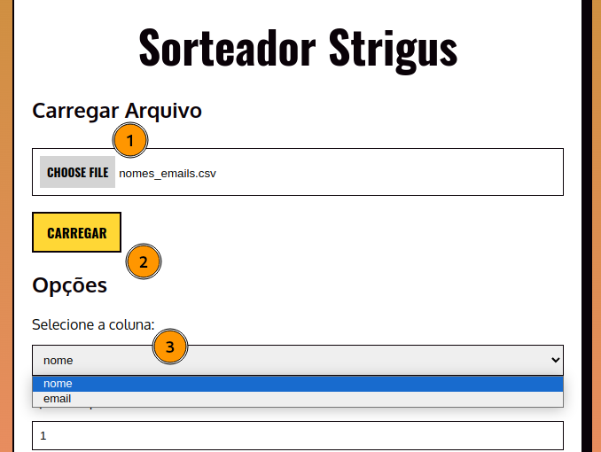
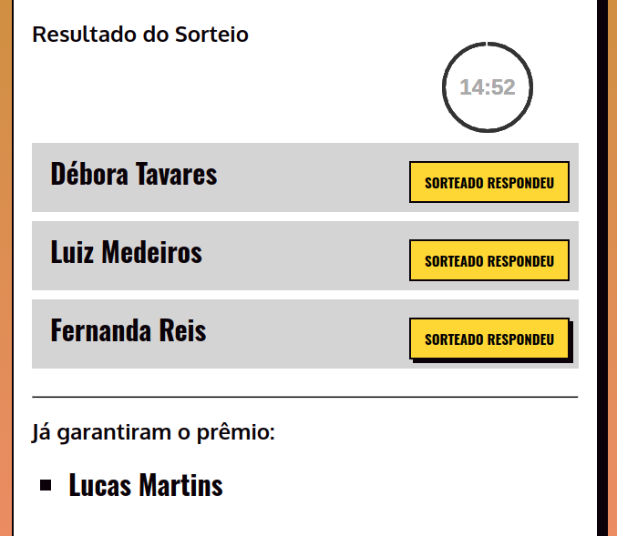
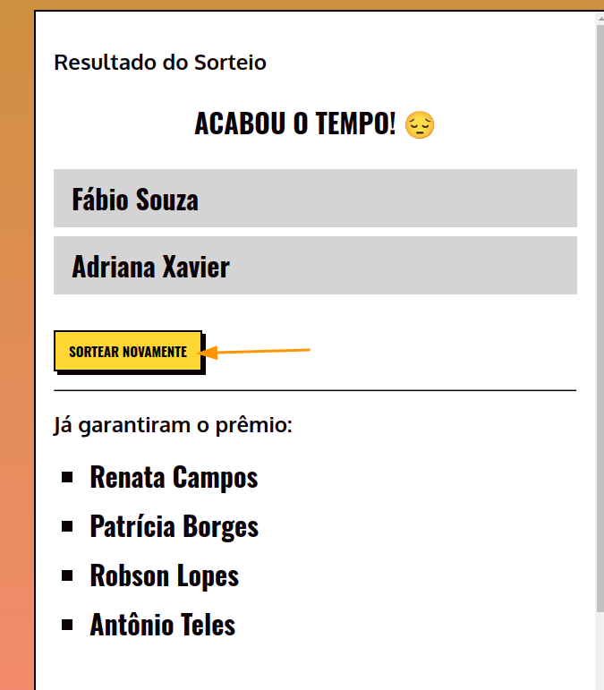
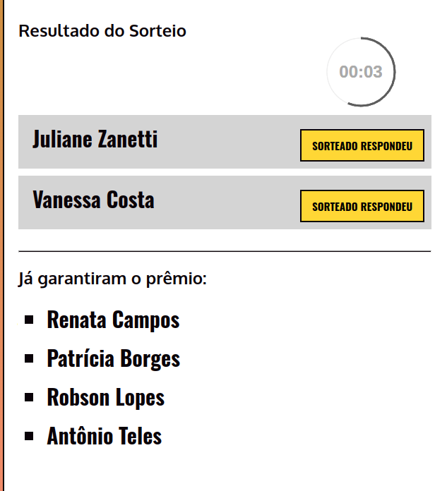

## Sorteador Strigus

A aplicação "Sorteador Strigus" tem como objetivo facilitar a realização de sorteios pela LinuxTips em lives para a comunidade.

### Funcionamento
Você deve carregar um arquivo ".csv" ou ".xlsx" que deve conter uma coluna com todos os nomes das pessoas concorrendo ao sorteio. Selecione o arquivo utilizando o campo "Escolher Arquivo" (1) ou simplesmente arraste até o quadro e solte-o. Após isso, clique no botão "Carregar" (2).
Após o carregamento, selecione qual a coluna do seu arquivo deverá ser utilizada para o sorteio (3), conforme exemplo

Com o arquivo carregado, insira quantas pessoas deverão ser sorteadas, e após isso selecione entre as seguintes opções:

 1. Clicar em "Sortear", que exibirá o resultado do sorteio imediatamente;
 2. Selecionar o campo "Com emoção" antes de clicar em "Sortear", que iniciará uma contagem regressiva de 10 segundos antes de exibir o resultado do sorteio;
 3. Selecionar o campo "Modo Live" antes de clicar em "Sortear", onde você deverá definir quantos minutos os sorteados terão para se manifestar e garantir o prêmio;
 4. Selecionar ambos os campos antes de clicar em "Sortear", que fará ser exibida a contagem de 10 segundos e após isso tem início o sorteio em "Modo Live".
##
### Sobre o Modo Live
A ideia do Modo Live é promover a interação do público da Live de modo que o sorteado deverá se manifestar dentro do tempo determinado para não perder o prêmio. Quando algum dos sorteados se manifestar, o botão "Sorteado Respondeu" em frente ao seu nome deverá ser pressionado, o que fará seu nome ir para a sessão "Já garantiram o prêmio"

Quando o cronômetro zerar, todas as pessoas que não se manifestaram a tempo perderão o prêmio e o botão "Sortear Novamente" será exibido. Este botão irá realizar novamente o sorteio de todas as pessoas cujo os nomes não estão na sessão "Já garantiram o prêmio"

##
### Tecnologias Utilizadas
Esta aplicação está utilizando um backend em Python e tratando os sorteios através das bibliotecas "pandas" e "numpy". Para persistir os dados das pessoas que já foram sorteadas, a aplicação está utilizando um banco de memória Redis. 
O frontend está construido utilizando Javascript e o contador que é exibido quando clicamos em "Com emoção" foi baseado no projeto desenvolvido por [Fabio Ottaviani](https://codepen.io/supah), disponível em: https://codepen.io/supah/pen/wGvNWN
Foi utilizado o [Docker](./app/Dockerfile) e o [Go](./app/go-bin-exec/main.go) para a criação de uma imagem de container distroless que executa tanto o Redis quanto o Flask do Python como entrypoint. Podemos utilizar o Redis apenas com cache local do container para este projeto pois cada sorteio terá sua própria lista.
##
### Como executar
Você poderá executar esta aplicação localmente de maneira simples utilizando o Docker. Para isto, siga os seguintes passos:

1. Baixe a imagem de container da aplicação:

    docker pull mayaracoelho/sorteador-strigus:v1.0

2. Execute a aplicação com base na imagem

    docker run -p 5000:5000 mayaracoelho/sorteador-strigus:v1.0

3. Acesse seu navegador no endereço http://localhost:5000 ou http://127.0.0.1:5000

Estou deixando o arquivo "[nomes_emails.csv](nomes_emails.csv)" disponível para que você possa testar a aplicação. Este arquivo possui 10.000 nomes gerados de maneira aleatória para os testes de funcionamento da aplicação
##
### Conclusão
Se gostou desse projeto deixe uma "Estrela" neste repositório. Sugestões de melhorias são bem-vindas! Basta fazer um Pull Request com as alterações que desejar.
Qualquer dúvida, entre em contato através do meu [LinkedIn](https://www.linkedin.com/in/mayarabcoelho/)